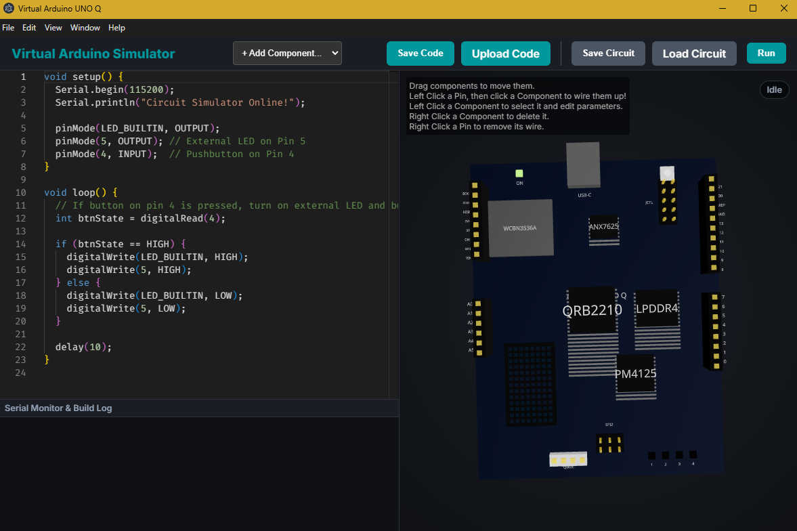

# Virtual Arduino Simulator

A powerful, interactive 3D Arduino simulator built with React Three Fiber, Electron, and the Arduino CLI. This application allows you to build, wire, and write code for your own electronic circuits completely virtually, rendering everything in a beautiful interactive 3D environment.



## ✨ Features

- **Interactive 3D Environment**: Orbit, pan, and zoom around a fully rendered 3D workspace powered by `@react-three/fiber`.
- **Advanced Electrical Routing Engine**: Unlike simple point-to-point simulators, this app features a true graph-based electrical routing engine. Signals travel realistically across wires, through breadboard rows, and power rails.
- **Component Library**: Includes a wide array of interactive components:
  - **Inputs**: Pushbuttons, Slide Switches, Potentiometers.
  - **Outputs**: LEDs, Buzzers, DC Motors, Servo Motors, OLED Displays.
  - **Passives**: Resistors, Capacitors, Inductors, Transistors, Diodes.
  - **Boards**: Arduino Uno and standard Half-size Breadboards (400 tie-points).
- **Integrated Code Editor**: Built-in Monaco editor (the engine behind VS Code) for writing standard Arduino C++ code.
- **Real-time Compilation & Simulation**: Powered by Electron and the Arduino CLI, your code compiles and simulates the actual hardware responses. Click a virtual button, and your C++ `digitalRead` catches it instantly!
- **Save & Load Functionality**: Easily save your code (`.ino`) and your physical circuit configurations (`.json`) and share them with others.

## 🚀 Tech Stack

- **Frontend Core**: React 18, TypeScript, Vite
- **3D Rendering**: Three.js, `@react-three/fiber`, `@react-three/drei`
- **Desktop Environment**: Electron
- **Compiler integration**: Node.js `child_process` hooking into the official Arduino CLI
- **Styling**: Vanilla CSS with modern dark-mode aesthetics
- **Interaction**: `@use-gesture/react` for intuitive drag-and-drop mechanics

## 🛠️ Installation & Setup

Before running this project, ensure you have [Node.js](https://nodejs.org/) installed, as well as the [Arduino CLI](https://arduino.github.io/arduino-cli/) accessible in your system's PATH.

1. **Clone the repository:**
   ```bash
   git clone https://github.com/yourusername/virtual-arduino.git
   cd virtual-arduino
   ```

2. **Install dependencies:**
   ```bash
   npm install
   ```

3. **Run the development server & Electron app:**
   ```bash
   npm run dev
   ```

## 🎮 How to Use

1. **Add Components**: Use the dropdown in the top-left toolbar to add an Arduino, breadboard, LEDs, etc.
2. **Move Components**: Drag any component directly across the 3D table.
3. **Wire Components**: Click on any pin, breadboard hole, or component leg to start a wire. Click on any other pin to connect them. The wire will dynamically follow your cursor.
4. **Delete wires/components**: Hover over a wire and click it to delete it, or right-click a component to delete it via a confirmation prompt. You can also edit component properties (like resistance or capacitance) in the right-hand panel.
5. **Write Code**: Use the integrated code editor to write standard Arduino C++.
6. **Simulate**: Click the green "Run" button! Your code will compile and execute, sending real-time signals back and forth between the C++ engine and the 3D frontend.

## 🤝 Contributing

Contributions, issues, and feature requests are welcome! Feel free to check the [issues page](https://github.com/yourusername/virtual-arduino/issues).

## 📝 License

This project is licensed under the MIT License.
