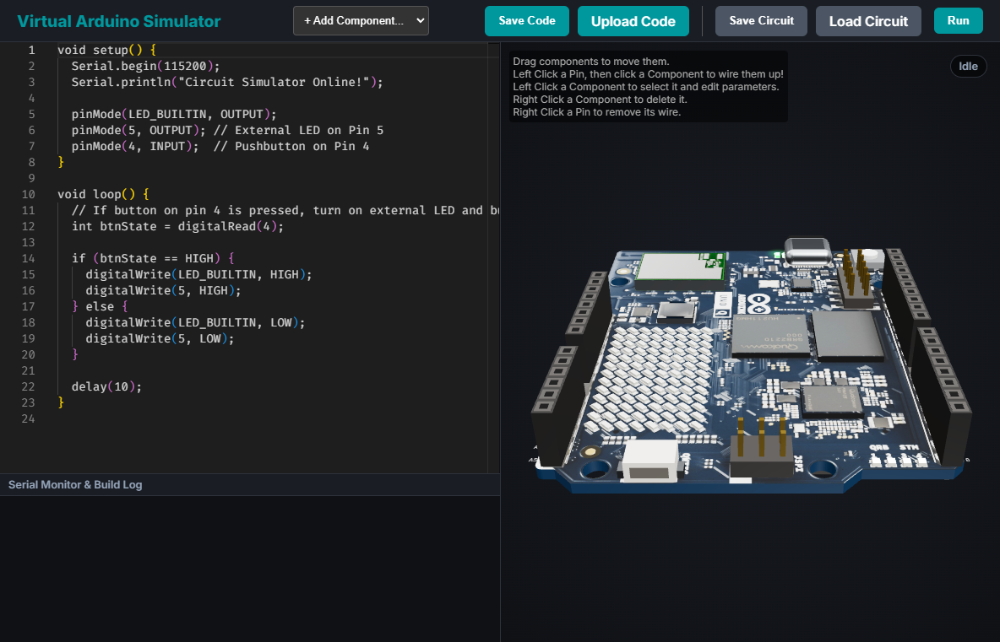

# Virtual Arduino Simulator

A powerful, interactive 3D Arduino simulator built with React Three Fiber and Electron. This application allows you to build, wire, and write code for your own electronic circuits completely virtually, rendering everything in a beautiful interactive 3D environment.



## ✨ Features

- **Interactive 3D Environment**: Orbit, pan, and zoom around a fully rendered 3D workspace powered by `@react-three/fiber`.
- **Real Circuit Physics**: The circuit is solved electrically ~50 times a second (nodal analysis with Newton-Raphson for LEDs, diodes and transistors, time stepping for capacitors and inductors). Voltages and currents follow Ohm's and Kirchhoff's laws, through wires, breadboard rows and power rails.
  - The UNO Q's GPIOs are 3.3 V outputs with a realistic output resistance and a 20 mA limit. The 5V, 3V3 and 1V8 rails switch off on a short circuit.
  - Inputs read the real node voltage, with Schmitt-trigger thresholds. `INPUT_PULLUP`/`INPUT_PULLDOWN` are supported, a floating input reads random values, and `analogRead()` returns the actual voltage (10-bit).
  - Parts have real ratings and **burn out** when overloaded. For example, an LED without a series resistor on 5 V, a 10 Ω resistor across 5 V, or a reversed electrolytic capacitor. A burnt part can be replaced from its properties panel.
  - Warnings explain what is wrong: pin overcurrent, floating inputs, 5 V on A0/A1, a motor driven straight from a pin, and more.
- **Component Library**: Includes a wide array of interactive components:
  - **Inputs**: Pushbuttons, Slide Switches, Potentiometers.
  - **Outputs**: LEDs, Buzzers, DC Motors, Servo Motors, OLED Displays.
  - **Passives**: Resistors, Capacitors, Inductors, Transistors, Diodes.
  - **Boards**: Arduino Uno and standard Half-size Breadboards (400 tie-points).
- **Integrated Code Editor**: Built-in Monaco editor (the engine behind VS Code) for writing standard Arduino C++ code.
- **Real-time Compilation & Simulation**: Your sketch is compiled with g++ against a mock Arduino core and runs as a native process, exchanging pin states with the circuit simulation. This works both in the desktop app and in the browser. Click a virtual button, and your C++ `digitalRead` catches it instantly!
- **Save & Load Functionality**: Easily save your code (`.ino`) and your physical circuit configurations (`.json`) and share them with others.

## 🚀 Tech Stack

- **Frontend Core**: React 18, TypeScript, Vite
- **3D Rendering**: Three.js, `@react-three/fiber`, `@react-three/drei`
- **Desktop Environment**: Electron
- **Compiler integration**: Node.js `child_process` running g++ (`electron/runner.js`). It is used by the Electron main process and, for the web interface, by a Vite dev-server plugin.
- **Styling**: Vanilla CSS with modern dark-mode aesthetics
- **Interaction**: `@use-gesture/react` for intuitive drag-and-drop mechanics

## 🛠️ Installation & Setup

Before running this project, ensure you have [Node.js](https://nodejs.org/) installed, as well as a C++17 compiler (`g++`) accessible in your system's PATH. On Windows, use [MinGW-w64](https://www.mingw-w64.org/), e.g. via WinLibs or MSYS2.

1. **Clone the repository:**
   ```bash
   git clone https://github.com/yourusername/virtual-arduino.git
   cd virtual-arduino
   ```

2. **Install dependencies:**
   ```bash
   npm install
   ```

3. **Run it in the browser** (development server; the dev server compiles and runs your sketches):
   ```bash
   npm run dev
   ```
   Then open http://localhost:5173.

4. **Or run the desktop app** (Electron loads the production build, so rebuild after changes):
   ```bash
   npm run build
   npm start
   ```

## 🎮 How to Use

1. **Add Components**: Use the dropdown in the top-left toolbar to add an Arduino, breadboard, LEDs, etc.
2. **Move Components**: Drag any component directly across the 3D table.
3. **Wire Components**: Click on any pin, breadboard hole, or component leg to start a wire. Click on any other pin to connect them. The wire will dynamically follow your cursor.
4. **Delete wires/components**: Hover over a wire and click it to delete it, or right-click a component to delete it via a confirmation prompt.
5. **Inspect and edit parts**: Click a component to open its panel. It shows the live voltage, current and power against the part's rating, and lets you edit values (resistance, capacitance, LED colour…).
6. **Write Code**: Use the integrated code editor to write standard Arduino C++.
7. **Simulate**: Click the green "Run" button! Your code will compile and execute, sending real-time signals back and forth between the C++ engine and the 3D frontend. Wire things as you would on a real bench. `circuit_test.json` contains the example circuit for the default sketch: a button from D4 to GND using `INPUT_PULLUP`, and an LED on D5 with a 220 Ω resistor.

## 🤝 Contributing

Contributions, issues, and feature requests are welcome! Feel free to check the [issues page](https://github.com/yourusername/virtual-arduino/issues).

## 📝 License

This project is licensed under the MIT License.
